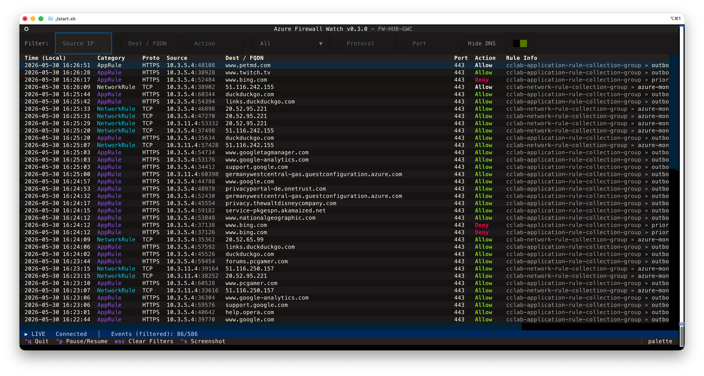
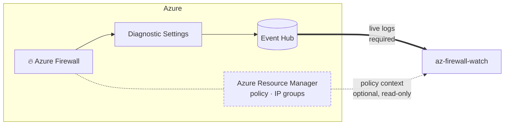

# 🔥 Azure Firewall Watch

Azure Firewall Watch is a terminal UI for **live log monitoring of Azure Firewall**.
It streams logs from an Event Hub in real time and lets you filter and inspect them
directly in your terminal. With read access to Azure Resource Manager it also shows
the firewall's policy and IP groups, and explains which rule a log row matched.

Built by [CloudChristoph](https://github.com/cloudchristoph).

> This project is based on the excellent work by [Nicola Delfino](https://github.com/nicolgit) and his
> [azure-firewall-mon](https://github.com/nicolgit/azure-firewall-mon) project.



## ✨ What it does

- **Live log stream** from an Event Hub: structured and legacy log formats, ten
  categories from `NetworkRule` to `FatFlow`, with automatic reconnect.
- **Instant filters** on source, destination, action, category, protocol and port,
  plus one-click presets that separate decisions from observations and DNS noise.
- **Policy context**: Firewall, Policy and IP Groups tabs built from Azure
  Resource Manager, with log rows enriched by what the policy says.
- **Evaluation trace**: press `Enter` on a row to see the path that flow took
  through the policy, collection by collection, up to the rule that matched.
- **Setup wizard** that finds or deploys the Event Hub, wires up Diagnostic
  Settings and writes your `.env`.
- **Single binary** for Windows, macOS and Linux, with no Python install required.

## 🏗️ How it works

The viewer reads from two independent sources. Only the first one is required:



1. **Diagnostic Settings** on your Azure Firewall forward the log categories to an
   Event Hub namespace, which buffers them so the viewer can consume them live.
   → [Event Hub and diagnostic settings](docs/event-hub.md)

2. **Azure Resource Manager** is read on demand for the firewall, its policy and the
   referenced IP groups. This is what powers the extra tabs and the evaluation
   trace, it is strictly read-only, and it can be switched off entirely.
   → [Policy context](docs/policy-context.md)

## 🚀 Quick start

Download the binary for your platform from the
[latest release](https://github.com/cloudchristoph/az-firewall-watch/releases/latest)
and run it. The setup wizard starts automatically on first launch:

```bash
# macOS / Linux
tar -xzf az-firewall-watch-linux.tar.gz
./az-firewall-watch
```

```powershell
# Windows
.\az-firewall-watch.exe
```

Or run from source (Python 3.10+):

```bash
git clone https://github.com/cloudchristoph/az-firewall-watch.git
cd az-firewall-watch
./start.sh          # Windows: start.bat
```

Platform notes (Gatekeeper, SmartScreen) and the full wizard walkthrough are in
[Getting started](docs/getting-started.md).

## 📚 Documentation

| Page | What's in it |
| ---- | ------------ |
| [Getting started](docs/getting-started.md) | Install per platform, run from source, the setup wizard step by step |
| [Using the viewer](docs/using-the-viewer.md) | Log table, filters and presets, row details, key bindings, status bar |
| [Policy context](docs/policy-context.md) | Firewall / Policy / IP Groups tabs, evaluation trace, permissions, cache, on-off switch |
| [Configuration](docs/configuration.md) | `.env` without the wizard, environment variables, command-line options, required Azure roles |
| [Log categories](docs/log-categories.md) | Which Azure categories are parsed, and how to enable flow trace and fat flow |
| [Event Hub](docs/event-hub.md) | How logs get to the hub, diagnostic settings, retention and cost |
| [Development](docs/development.md) | Building the binary, running the test suite, project layout |

## 📄 License

MIT. See [LICENSE](LICENSE).
