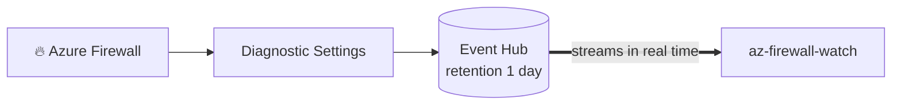

# Event Hub

Azure Firewall Watch does not talk to the firewall to get logs. It reads them from
an **Azure Event Hub** that receives firewall events via **Diagnostic Settings**:



1. **Diagnostic Settings** on your Azure Firewall forward the log categories to an
   Event Hub namespace.
   → [Configure Azure Firewall diagnostics](https://learn.microsoft.com/en-us/azure/firewall/monitor-firewall#enable-structured-logs)

2. **Event Hub** buffers the events (default retention: 1 day), so the viewer can
   consume them live and, with `EVENT_HUB_START_POSITION=earliest`, replay what
   is still in the buffer.
   → [Azure Event Hubs overview](https://learn.microsoft.com/en-us/azure/event-hubs/event-hubs-about)

The [setup wizard](getting-started.md#-the-setup-wizard) can do all of this for
you, including creating the namespace and hub. This page is for the cases where
you build it yourself.

## Which categories to enable

The viewer parses both the structured (`AZFW*`) and the legacy (`AzureFirewall*`)
categories, see [Log categories](log-categories.md). When the wizard creates a
diagnostic setting, it enables exactly these nine:

```text
AZFWNetworkRule          AZFWApplicationRule     AZFWNatRule
AZFWThreatIntel          AZFWIdpsSignature       AZFWDnsQuery
AZFWFqdnResolveFailure   AZFWFlowTrace           AZFWFatFlow
```

Deliberately left out: the three `*Aggregation` categories (Policy Analytics) and
`AZFWDnsAdditional`. The viewer does not display them, so they would only add
Event Hub volume and cost.

If you create the diagnostic setting yourself, point it at your hub (the wizard's
own deployment names it `firewall-logs`) and pick the same categories.
→ [Diagnostic settings documentation](https://learn.microsoft.com/en-us/azure/azure-monitor/platform/diagnostic-settings)

## 💰 What it costs

An Event Hub for firewall logs is typically inexpensive:

| Tier                | ~Rough monthly cost                                                       |
| ------------------- | ------------------------------------------------------------------------- |
| **Basic** (1 TU)    | ~$10 + ~$0.028 per million events                                         |
| **Standard** (1 TU) | ~$22 + ~$0.028 per million events, required for multiple consumer groups |

Firewall log volume depends on traffic intensity. Most environments stay
comfortably within a single Throughput Unit. Enabling `FlowTrace` and `FatFlow`
changes that picture, so treat them as troubleshooting tools rather than
permanent settings.

→ [Event Hubs pricing](https://azure.microsoft.com/pricing/details/event-hubs/)

> [!TIP]
> The built-in setup wizard can deploy a Basic-tier namespace and configure the
> diagnostic settings automatically in ~2–3 minutes. Provisioning and the first
> events can take 10–15 minutes to appear afterwards.
