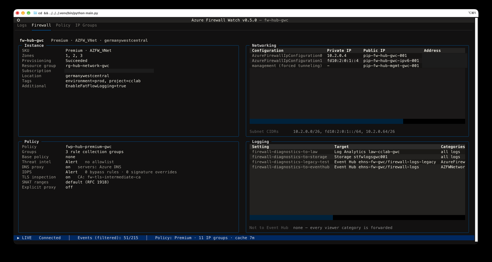
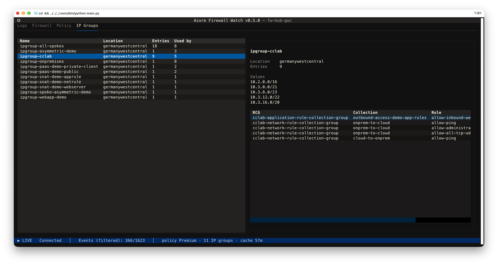
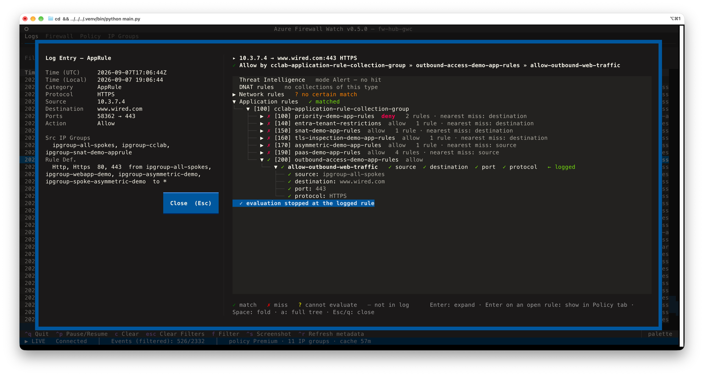

# Policy context

Policy context is the viewer's second data source: alongside the log stream from
the Event Hub, it reads the firewall, its policy and the referenced IP groups from
**Azure Resource Manager (ARM)**. That turns log rows from "something was denied"
into "this rule denied it, here is what the rule says, and here is everything the
firewall evaluated before it".

It is **read-only**, **on by default**, and can be switched off completely
(see [Turning it off](#turning-it-off)).

No configuration is needed to point it at your firewall: the viewer takes the
resource ID from the first log record it receives and fetches from there.

## What you get

### Three extra tabs

- **Firewall**: four blocks about the instance itself.
  - *Instance*: SKU tier and name, zones, provisioning state, resource group,
    subscription, location, tags.
  - *Networking*: every IP configuration with its private IP and the name and
    address of its public IP, the management IP (marked *forced tunneling*),
    subnet names and CIDRs, and additional properties such as
    `EnableFatFlowLogging`.
  - *Policy*: the attached policy with its number of rule collection groups
    including inherited ones, base policy, Threat Intelligence mode and allowlist,
    DNS proxy and its servers, IDPS mode with bypass and override counts, TLS
    inspection with the CA name, SNAT ranges, explicit proxy, child policies.
  - *Logging*: the firewall's diagnostic settings with their targets (Event Hub,
    Log Analytics, Storage) and categories, plus a **Not to Event Hub** line
    naming the categories this viewer understands that no setting forwards. That
    line answers the most common question about a missing category before you
    start looking for a bug.
- **Policy**: a tree of rule collection groups → rule collections → rules, ordered
  by priority, with a detail pane showing sources, destinations, ports, protocols,
  and IP groups resolved to their actual addresses.
- **IP Groups**: every IP group the policy references, how many rules use it, and
  for the selected group the rules that reference it. `Enter` on a rule jumps to it
  in the Policy tab.

### Richer log rows

The metadata also feeds back into the **Logs** tab:

- Addresses inside the firewall's own subnets are rendered as `AzFw.<last octet>`,
  so traffic from the firewall instances themselves (DNS proxy, probes) stands out.
- The row detail dialog lists the IP groups that contain source and destination
  and the definition of the rule the firewall logged, looked up by name, never
  guessed. Whatever the trace beside it already shows (policy path, priorities,
  action, SKU) is left out rather than printed twice.
- The status bar shows a short summary: `Policy: Premium · 11 IP groups · fresh`.

## Evaluation trace

Press `Enter` on a log row to open its details with the trace beside them: the path
that flow took through the policy, in the order Azure Firewall actually uses.
Threat Intelligence first, then three passes over all rule collection groups
(DNAT, Network, Application), each in inherited-policy-first, then priority order,
stopping at the first match. The Application pass only runs for HTTP, HTTPS and
MSSQL flows.

The log entry's own fields sit on the left, the trace on the right. Each pass
reports its own verdict (`✓ matched`, `✗ no match`, `? no certain match`), and
under it the rule collection groups with their collections in priority order.
The collection's own action is the short tag after its name (`deny` in red,
`allow` quiet, `dnat` in yellow): the ✓ or ✗ in front says whether the flow
matched, the tag says what a match would have meant. Collections that did not
match name their nearest miss, so you can see how close each one came.

### What you are looking at

Everything before the logged rule was really evaluated and rejected by the
firewall. That part is fact, taken from the policy and the firewall's own verdict.
*Why* each rule failed is computed locally, criterion by criterion.

For `Deny · no rule matched` rows the whole path is computed, and the near misses
show which criterion failed, for example `port: 8443 not in 443`. That is usually
the fastest way to find the rule you *meant* to write.

### What `?` means

`?` marks criteria that cannot be evaluated locally, so the trace neither confirms
nor rejects them:

- service tags such as `AzureMonitor`
- FQDNs in network rules, FQDN tags and web categories
- target URLs
- IP groups your identity is not allowed to read

### Navigating it

| Key            | In the trace tree                                             |
| -------------- | ------------------------------------------------------------- |
| `Enter`        | Unfold a rule; on an unfolded rule, open it in the Policy tab |
| `Space`        | Fold it again                                                 |
| `a`            | Expand the whole tree, including collections that were skipped |
| `Escape` / `q` | Close the dialog                                              |

The trace is built only for rows that are a policy decision: `NetworkRule`,
`AppRule`, `NATRule` and `ThreatIntel`. For anything else the dialog shows the
row's fields alone and the status bar says why, either
*no policy evaluation for `<category>` rows* or
*trace needs policy metadata (not loaded)*.

> [!NOTE]
> The trace explains the **cached** policy. If the rule the firewall logged is
> missing from it, the trace says so and suggests `Ctrl` + `R`, since the rule may
> just have been renamed. A row naming an unknown rule also triggers a re-fetch on
> its own, see [Caching and staying current](#caching-and-staying-current).

## Authentication and permissions

The ARM client uses `DefaultAzureCredential` (Azure CLI login, managed identity,
environment credentials, …) and falls back to a token from the Azure CLI. That
means policy context also works when the Event Hub itself is read with a SAS
connection string.

Your identity needs **Reader** on the firewall, its policy, the IP groups it
references, and the firewall's subnets and public IPs. See
[required Azure permissions](configuration.md#required-azure-permissions).

Two of the reads are optional and fail quietly, because they only add detail to
the Firewall tab: one `GET` per public IP for its address, and one on the
firewall's `Microsoft.Insights/diagnosticSettings`. Without the first you still
get the public IP's name, without the second the Logging block says *no
diagnostic settings readable*.

Without ARM access at all nothing breaks: the status bar says *metadata
unavailable (no ARM access)*, the extra tabs stay empty and the viewer behaves
exactly as it does with policy context switched off.

## Caching and staying current

Metadata is cached for **one hour** in `~/.az-firewall-watch/cache.json` (file mode
`0600`, directory `0700`). If your home directory is not writable, the cache falls
back to `.azfw-cache.json` next to the binary. The file carries a version, so a
release that collects more metadata discards the old cache and fetches once on
first start rather than showing you a half-filled tab.

You rarely have to think about it, because the viewer keeps the cache current on
its own:

| Trigger                                                    | What happens                                                                 |
| ---------------------------------------------------------- | ---------------------------------------------------------------------------- |
| A log row names a rule the loaded policy does not know      | Re-fetch, status bar *refreshing metadata (new rule …)…*                      |
| The one-hour TTL runs out (checked once a minute)           | Re-fetch, status bar *refreshing metadata (cache expired)…*                   |
| `Ctrl` + `R`                                                | Re-fetch on demand, for instance right after you changed a rule in the portal |

Automatic re-fetches are rate-limited to one every five minutes, so a burst of
rows against a stale policy does not turn into a burst of ARM requests. `Ctrl` + `R`
is not rate-limited.

The status bar carries the cache age (`fresh` under a minute, then `cache 12m`),
so you can always see how old the policy behind the tabs and the trace is. Two
more states worth recognising:

- *refresh failed · showing previous metadata*: the re-fetch did not work, for
  example because the token expired. The previous data stays on screen rather
  than disappearing, so remember it is the older picture.
- *refresh skipped: no firewall seen yet*, meaning `Ctrl` + `R` came before the first log
  record arrived. The viewer learns the firewall from the records, so there is
  nothing to refresh yet.

## Turning it off

Policy context is a feature flag with three ways to set it, in this order of
precedence:

| Where            | How                                                | Scope        |
| ---------------- | -------------------------------------------------- | ------------ |
| Command line     | `--policy-context` / `--no-policy-context`          | One run      |
| `.env`           | `POLICY_CONTEXT=on` / `POLICY_CONTEXT=off`          | Persistent   |
| Setup wizard     | *Policy context* step, writes the `.env` key for you | Persistent   |

**What "off" actually means:** no ARM requests, no Azure CLI token, no cache file,
and the Logs tab only. `Enter` then shows the plain row details, and `Ctrl` + `R`
answers in the status bar with *policy context off (POLICY_CONTEXT=on or
--policy-context to enable)*.

**Upgrading from an earlier release:** a `.env` written before this feature existed
has no `POLICY_CONTEXT` key. The viewer then shows a one-time notice at start-up
explaining what policy context does (it is on by default) with a *Disable* button,
and saves your choice to `.env`, so you are only asked once.

While that notice is open **nothing is read from Azure**: no token, no ARM request,
no cache file. Logs keep streaming, and the firewall the records point at is simply
remembered. Answering *Keep enabled* fetches it once; *Disable* discards it and
ignores every firewall seen later.
