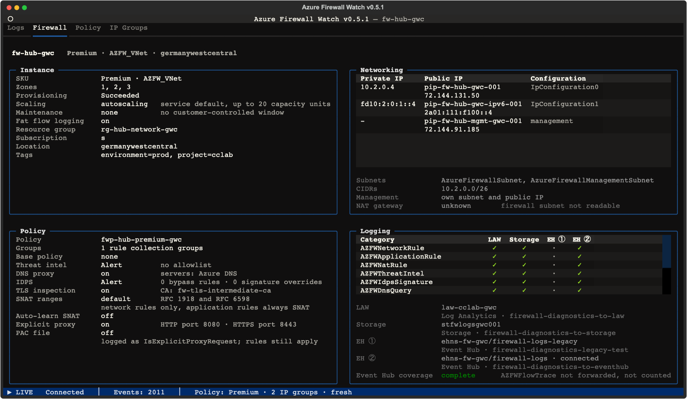
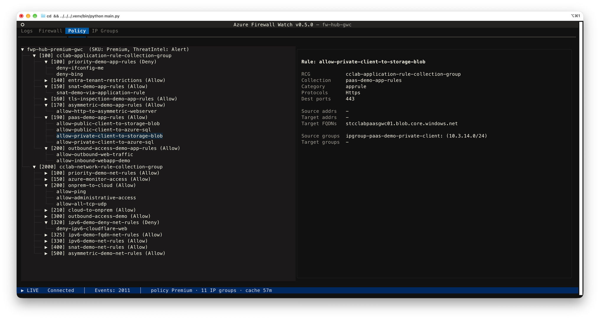
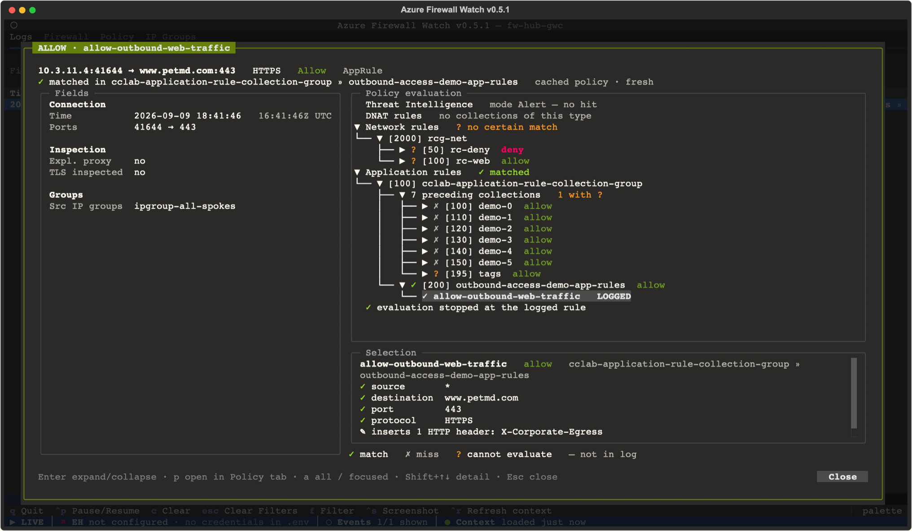

# Policy context

Policy context is the viewer's second data source: alongside the log stream from
the Event Hub, it reads the firewall, its policy and the referenced IP groups from
**Azure Resource Manager (ARM)**. That turns log rows from "something was denied"
into "this rule denied it, here is what the rule says, and here is everything the
firewall evaluated before it".

It is **read-only**, **on by default**, and can be switched off completely
(see [Turning it off](#turning-it-off)).

No configuration is needed to point it at your firewall: the viewer takes the
resource ID from the first log record it receives and fetches from there.

## What you get

### Three extra tabs

- **Firewall**: four blocks about the instance itself.
  - *Instance*: SKU tier and name, zones, provisioning state, how the firewall
    scales (service default, prescaled range, or fixed capacity with autoscaling
    off), the customer-controlled maintenance window if one is assigned, the
    switches that live in the firewall's property bag (fat flow logging, DNS
    flow trace, active FTP, and the classic DNS proxy and SNAT settings when
    set), resource group, subscription, location, tags.
  - *Networking*: a table with one row per IP configuration, each with its
    private IP and the name and address of its public IP, plus the management IP
    configuration when the firewall has one. Underneath: subnets, their CIDRs,
    what the management configuration means (it is what forced tunnelling needs
    and what the Basic SKU requires, not proof that a route tunnels anything),
    and whether a NAT gateway sits on the firewall subnet. With a gateway,
    traffic routed straight to the internet leaves with the gateway's public IPs
    while DNAT and management traffic stay on the firewall's own. The viewer
    reads no route tables, so both lines say what they cannot know.
  - *Policy*: the attached policy with its number of rule collection groups
    including inherited ones, base policy, Threat Intelligence mode and allowlist,
    DNS proxy and its servers, IDPS mode with bypass and override counts, TLS
    inspection with the CA name, SNAT ranges with the auto-learn state and its
    Route Server, explicit proxy with its ports and PAC file, child policies.
  - *Logging*: a matrix of log categories against the targets of the
    firewall's diagnostic settings (Event Hub, Log Analytics, Storage), the
    viewer's categories first, and a legend naming each target and the
    setting behind it. Below it, one **Event Hub coverage** line says whether
    the Event Hub this viewer reads from carries every category this firewall
    can produce: green *complete*, or yellow *incomplete* with the missing
    names. Categories the configuration cannot produce are not expected (no
    IDPS log without Premium and IDPS on, no DNS log without the proxy, no
    fat flow log without the switch, no threat intel log with the mode off);
    flow trace depends on a subscription feature the viewer does not read, so
    it is named but never counted as missing. That line answers the most
    common question about a missing category before you start looking for a
    bug.
- **Policy**: a tree of rule collection groups → rule collections → rules, ordered
  by priority, with a detail pane showing sources, destinations, ports, protocols,
  IP groups resolved to their actual addresses and, on application rules, TLS
  inspection and the HTTP headers the rule inserts. Header names are always shown;
  the values can carry tokens or tenant ids, so they stay hidden until you press
  `v`, and a refresh hides them again.
- **IP Groups**: every IP group the policy references, how many rules use it, and
  for the selected group the rules that reference it. `Enter` on a rule jumps to it
  in the Policy tab.

### Richer log rows

The policy context also feeds back into the **Logs** tab:

- Addresses inside the firewall's own subnets are rendered as `AzFw.<last octet>`,
  so traffic from the firewall instances themselves (DNS proxy, probes) stands out.
- The row detail dialog lists the IP groups that contain source and destination.
  Whatever the trace beside it already shows (the logged rule and its criteria,
  policy path, priorities, action, SKU) is left out rather than printed twice;
  the rule's full definition is one `p` away in the Policy tab.
- The status bar's Context segment shows whether the context is loaded and how
  old it is: `● Context loaded 35m ago`.

## Evaluation trace

Press `Enter` on a log row to open its details with the trace beside them: the path
that flow took through the policy, in the order Azure Firewall actually uses.
Threat Intelligence first, then three passes over all rule collection groups
(DNAT, Network, Application), each in inherited-policy-first, then priority order,
stopping at the first match. The Application pass only runs for HTTP, HTTPS and
MSSQL flows.

The dialog's header says what happened: connection, protocol and the logged
action on the first line, the trace's outcome and the cache age on the second
(`✓ matched in rcg-net » rc-web   cached policy · 12 min`); the frame's title
tab names the action and the rule (`ALLOW · allow-web`) and the frame takes the
action's colour. The log entry's own fields sit on the left in a *Fields*
frame, the trace on the right under *Policy evaluation*. Each pass reports
its own verdict (`✓ matched`, `✗ no match`, `? no certain match`), and under it
the rule collection groups with their collections in priority order. Lines are
status, priority and name only; the collection's own action is the short tag
after its name (`deny` in red, `allow` quiet, `dnat` in yellow): the mark in
front says whether the flow matched, the tag says what a match would have
meant.

The tree opens focused on the logged rule: it is selected and scrolled into
view, the collections the firewall rejected before it are folded into one line
(`7 preceding collections   all ✗`), the ones it never reached into another
(`3 not evaluated`). A `?` inside a folded range keeps that range open, so an
unknown never disappears behind a fold. `a` switches to the full tree and back.

Under the tree a detail line follows the selection: for a rule its full name,
collection, group and action, then one line per criterion with the observed
value and what the rule expected (`✗ port   8443 not in 443`); for a collection
its verdict and the reason; for a pass its note. Names cut with `…` in the
tree are whole here. A rule that inserts HTTP headers names them here, never
their values.

### What you are looking at

Everything before the logged rule was really evaluated and rejected by the
firewall. That part is fact, taken from the policy and the firewall's own verdict.
*Why* each rule failed is computed locally, criterion by criterion.

For `Deny · no rule matched` rows the whole path is computed, and the near misses
show which criterion failed, for example `port: 8443 not in 443`. That is usually
the fastest way to find the rule you *meant* to write.

### What `?` means

`?` marks criteria that cannot be evaluated locally, so the trace neither confirms
nor rejects them:

- service tags such as `AzureMonitor`
- FQDNs in network rules, FQDN tags and web categories
- target URLs
- IP groups your identity is not allowed to read
- an address entry the viewer cannot read, in a rule's address list or in an IP
  group. The entry is named, so a typo is visible instead of silently dropped
- destination addresses on an **application** rule: Azure matches those against
  the address the firewall resolved from the `Host` header or the SNI, and that
  resolution is nowhere in the log

Two things the log writes differently from what the rule says, and the trace
translates rather than marks: a request through the **explicit proxy** is logged
with the real destination port, not the proxy port, so the port compares as usual
and the criterion only notes *via explicit proxy*; a **TLS-inspected** HTTPS
request is logged as the decrypted inner request, `Protocol` `HTTP/1.1` with
`IsTlsInspected` true, and the trace reads it as HTTPS for the rule. Both were
checked against real records rather than the documentation.

### Navigating it

| Key            | In the trace tree                                             |
| -------------- | ------------------------------------------------------------- |
| `Enter`        | Fold or unfold the selected node                              |
| `p`            | Open the selected rule in the Policy tab                      |
| `a`            | The full tree, including the folded collections, and back     |
| `Shift` + `↑` / `↓` | Scroll the selection detail under the tree                |
| `Tab`          | On a terminal under 120 columns: switch between *Fields* and *Policy trace* |
| `Escape` / `q` | Close the dialog; the footer's Close button does the same, and without a trace `Enter` closes too |

Below 120 columns the fields and the trace are tabs rather than columns, and
the trace tab opens first. Below 40 rows the selection detail shrinks so the
tree keeps its rows, below 30 it keeps only its name lines. The header's
outcome line is measured against the dialog's width: when it would wrap it
drops the group and collection, then the cache age, and keeps the rule name.
Nothing is cut off: every pane scrolls.

The trace is built only for rows that are a policy decision: `NetworkRule`,
`AppRule`, `NATRule` and `ThreatIntel`. For anything else the dialog shows the
row's fields alone and says why underneath: *No rule decision in this log*, with
what that category records instead (FatFlow the top flows by rate, FlowTrace the
handshake and flags, DNS proxy rows the query and its answer, IDPS a signature
hit), or *Policy trace not available* while the policy context is not loaded
yet. The status bar keeps its Context segment as it is.

> [!NOTE]
> The trace explains the **cached** policy. If the rule the firewall logged is
> missing from it, the trace says so and suggests `Ctrl` + `R`, since the rule may
> just have been renamed. A row naming an unknown rule also triggers a re-fetch on
> its own, see [Caching and staying current](#caching-and-staying-current).

## Authentication and permissions

The ARM client uses `DefaultAzureCredential` (Azure CLI login, managed identity,
environment credentials, …) and falls back to a token from the Azure CLI. That
means policy context also works when the Event Hub itself is read with a SAS
connection string.

Your identity needs **Reader** on the firewall, its policy, the IP groups it
references, and the firewall's subnets and public IPs. See
[required Azure permissions](configuration.md#required-azure-permissions).

Four of the reads are optional and fail quietly, because they only add detail to
the Firewall tab: one `GET` per public IP for its address, one on the firewall's
`Microsoft.Insights/diagnosticSettings`, one on a NAT gateway attached to the
firewall subnet, and one per maintenance configuration assigned to the firewall.
Without the first you still get the public IP's name, without the second the
Logging block says *no diagnostic settings readable*, and the other two say the
gateway or the window is *not readable* instead of pretending there is none.
If the `Microsoft.Maintenance` provider is not registered in the subscription
there is simply no assignment to read, and the tab says *no customer-controlled
window*.

Without ARM access nothing breaks: the status bar says
`○ Context unavailable · see Firewall tab`, the Firewall tab shows the exact
error in place of its blocks (a refused token, a missing Reader role, an
unreachable host, a failed certificate check), the Policy and IP Groups tabs
step aside until a load succeeds, and `Ctrl` + `R` tries again. The glyph is the
quiet one on purpose: the context is optional, so missing it is a state, not an
error. The error text is also the status bar's tooltip.

## Caching and staying current

The policy context is cached for **one hour** in the cache directory your
operating system reserves per user: `~/Library/Caches/az-firewall-watch/` on
macOS, `~/.cache/az-firewall-watch/` on Linux (`$XDG_CACHE_HOME` when set),
`%LOCALAPPDATA%\az-firewall-watch\Cache\` on Windows; the file is `cache.json`
(mode `0600`, directory `0700`). If that directory cannot be created, the cache
falls back to `.azfw-cache.json` next to the binary. Releases before 0.6.1 wrote
`~/.az-firewall-watch/cache.json`; that directory is no longer read and can be
deleted. The file carries a version, so a
release that reads more from ARM discards the old cache and fetches once on
first start rather than showing you a half-filled tab.

You rarely have to think about it, because the viewer keeps the cache current on
its own:

| Trigger                                                    | What happens                                                                 |
| ---------------------------------------------------------- | ---------------------------------------------------------------------------- |
| A log row names a rule the loaded policy does not know      | Re-fetch, status bar `◐ Context refreshing · new rule …`                      |
| The one-hour TTL runs out (checked once a minute)           | Re-fetch, status bar `◐ Context refreshing · cache expired`                   |
| `Ctrl` + `R` (*Refresh context*)                            | Re-fetch on demand, for instance right after you changed a rule in the portal |

Automatic re-fetches are rate-limited to one every five minutes, so a burst of
rows against a stale policy does not turn into a burst of ARM requests. `Ctrl` + `R`
is not rate-limited.

The status bar carries the cache age (`loaded just now` under a minute, then
`loaded 12m ago`), so you can always see how old the policy behind the tabs and
the trace is. Two more situations worth recognising:

- `● Context loaded 61m ago · refresh failed`: the re-fetch did not work, for
  example because the token expired. The previous data stays on screen rather
  than disappearing, so remember it is the older picture. A notification says
  the same when it happens.
- `Ctrl` + `R` before the first log record answers with the notification *Nothing
  to refresh yet: no firewall seen in the logs*. The viewer learns the firewall
  from the records, and until then the segment reads `○ Context pending`.

## Turning it off

Policy context is a feature flag with three ways to set it, in this order of
precedence:

| Where            | How                                                | Scope        |
| ---------------- | -------------------------------------------------- | ------------ |
| Command line     | `--policy-context` / `--no-policy-context`          | One run      |
| `.env`           | `POLICY_CONTEXT=on` / `POLICY_CONTEXT=off`          | Persistent   |
| Setup wizard     | *Policy context* step, writes the `.env` key for you | Persistent   |

**What "off" actually means:** no ARM requests, no Azure CLI token, no cache file,
and the Logs tab only. The status bar reads `○ Context off`, `Enter` shows the
plain row details, and `Ctrl` + `R` answers with the notification *Policy context
is off. Enable it with POLICY_CONTEXT=on or --policy-context*.

**Upgrading from an earlier release:** a `.env` written before this feature existed
has no `POLICY_CONTEXT` key. The viewer then shows a one-time notice at start-up
explaining what policy context does (it is on by default) with a *Disable* button,
and saves your choice to `.env`, so you are only asked once.

While that notice is open **nothing is read from Azure**: no token, no ARM request,
no cache file. Logs keep streaming, and the firewall the records point at is simply
remembered. Answering *Keep enabled* fetches it once; *Disable* discards it and
ignores every firewall seen later.
