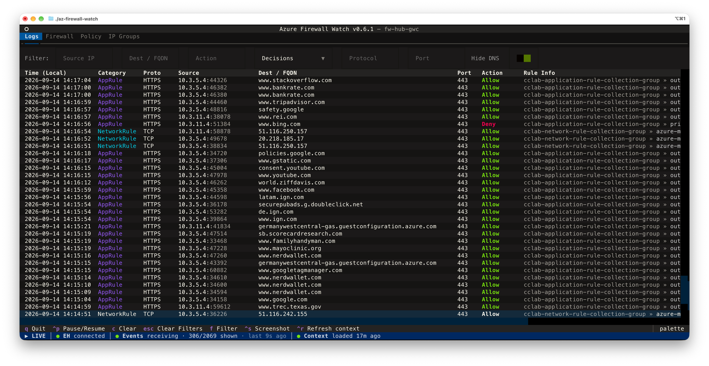

# Using the viewer

The **Logs** tab is where you spend most of your time: a live table of firewall
events, a filter bar above it, and a status bar at the bottom. Everything on this
page works without Azure Resource Manager access. The extra tabs and the
evaluation trace are described in [Policy context](policy-context.md).

## The log table

New events are appended as they arrive and the table stays sorted newest-first.
Columns:

| Column         | Contents                                                                       |
| -------------- | ------------------------------------------------------------------------------ |
| `Time (Local)` | Event timestamp converted to your local time zone                              |
| `Category`     | Display category, see [Log categories](log-categories.md)                      |
| `Proto`        | Protocol, or the DNS query type for `DnsQuery` rows                             |
| `Source`       | Source address                                                                  |
| `Dest / FQDN`  | Destination address or the requested FQDN                                       |
| `Port`         | Destination port (`-` when the record has none, e.g. ICMP)                       |
| `Action`       | `Allow`, `Deny`, `DNAT`, DNS response codes, TCP flow flags, fat-flow rates      |
| `Rule Info`    | Policy » rule collection group » rule collection » rule, with the segments styled progressively |

The viewer keeps up to 5,000 rows in memory; older rows are trimmed as new ones
arrive. `c` clears the table without interrupting the stream.

## Filters

All filters are **case-insensitive substring matches**, applied instantly as you
type. Press `f` to jump into the filter bar, `Tab` to move between inputs, and
`Escape` to clear everything at once.

<!-- markdownlint-disable MD060 -->
| Filter      | Matches against                                                                        |
| ----------- | -------------------------------------------------------------------------------------- |
| Source IP   | `sourceip` field                                                                       |
| Dest / FQDN | `targetip` / FQDN field                                                                |
| Action      | `allow`, `deny`, `dnat`, `alert`, `resolvefail`, DNS RCODEs (`noerror`, `nxdomain`, …), flow flags (`rst`, `invalid`, …), `mbps` |
| Category    | A preset or a single category, see below                                              |
| Protocol    | `TCP`, `UDP`, `HTTPS`, `HTTP`, DNS query types (`A`, `AAAA`, `MX`, …)                  |
| Port        | Destination port (e.g. `443`, `80`, `53`)                                              |
<!-- markdownlint-enable MD060 -->

### Category presets

FlowTrace and DNS proxy rows can flood the table. The Category dropdown therefore
starts with three presets, so one pick is enough:

| Preset        | Keeps                                                       | Use it when                                     |
| ------------- | ----------------------------------------------------------- | ----------------------------------------------- |
| **Decisions** | `NetworkRule`, `AppRule`, `NATRule`, `ThreatIntel`, `IDPS`   | You want rows where the firewall decided something |
| **Traffic**   | `FlowTrace`, `FatFlow`                                       | You are looking at observations, not verdicts    |
| **DNS**       | `DnsQuery`, `DnsFailure`                                     | You are chasing a resolution problem             |

Below the presets the dropdown lists every category individually. Picking **DNS**
(or the single `DnsQuery` category) switches the Hide-DNS toggle off for you.

### Hide DNS toggle

DNS proxy traffic can dominate the log volume on busy firewalls. A **Hide DNS**
switch sits at the end of the filter bar and is **on by default**, so `DnsQuery`
rows are filtered out until you explicitly ask for them. `DnsFailure` rows (the
firewall failing to resolve an FQDN from a rule) stay visible regardless.

How it interacts with the rest of the filter bar:

- Flipping it **off** instantly shows all DNS rows.
- Picking **DnsQuery** or the **DNS** preset in the Category dropdown flips it off
  automatically, so you never end up staring at an empty table after asking to see
  DNS entries.
- Pressing `Escape` to clear all filters resets the toggle back to **on**.

## Row details

`Enter` on the highlighted row opens the detail dialog. Its first line is the
connection, protocol and logged action; below it the record's fields in groups:
*Connection* (time local and UTC, ports, and what the category adds: flag, rate,
query, response, threat, signature), *Inspection* (explicit proxy, TLS inspection,
only when the record carries them) and *Rule* (policy, group, collection, rule).
`Escape` or `q` closes it.

The fields adapt to the category, because the raw log means different things
depending on it:

- **FlowTrace and FatFlow** rows show the connection as `Flow: client → server`
  and, below it, which way this particular packet went. Azure logs source and
  destination of the packet, not of the connection, so a return-direction record
  would otherwise look like the server initiated the flow.
- **NATRule** rows show the destination the client actually addressed, its ports,
  and a `Translated` line with what the firewall turned it into.
- Everything else shows source, destination and ports as logged.

When [policy context](policy-context.md) is available, the same dialog gains a
second header line with the trace's outcome and the cache age, a *Groups* block
with the IP groups containing source and destination, and the evaluation trace
beside the fields. The trace is described in
[Evaluation trace](policy-context.md#evaluation-trace); the keys inside the
dialog are `Enter` to fold a node, `p` to open the selected rule in the Policy
tab, `a` to switch between the focused and the full tree.

On a terminal narrower than 120 columns the fields and the trace become two
tabs inside the dialog, *Fields* and *Policy trace*, switched with `Tab`; the
trace tab opens first so the logged rule is the first thing on screen. Below
40 rows the selection detail under the tree gives its rows to the tree, below
30 it keeps only its name lines. A header line that would wrap drops the
group and collection and keeps the rule name. Every pane scrolls on its own.

Rows that are not a policy decision (`DnsQuery`, `DnsFailure`, `IDPS`, `FlowTrace`,
`FatFlow`) show their fields alone, with a line underneath that says why, for
example *No rule decision in this log: FatFlow records the top flows by rate, not
a rule decision*.

## Status bar

The bar at the bottom shows the connection state, the total number of events
received, the currently visible count while a filter is active, and how many
records were skipped (unknown or non-firewall categories). With policy context
enabled it also carries a short metadata summary such as
`Policy: Premium · 11 IP groups · fresh`.

Clicking the status bar pauses and resumes the stream, the same as `Ctrl` + `P`.

## Reconnects

If an established connection drops, the app reconnects on its own with a capped
backoff (2 s → 5 s → 10 s → 30 s → 60 s) and reports the countdown in the status
bar. Only the very first connection gives up after three attempts, and
authentication errors stop immediately with a hint rather than retrying.

## Key bindings

| Key          | Action                                                                                     |
| ------------ | ------------------------------------------------------------------------------------------ |
| `q`          | Quit. In a dialog the same key closes the dialog instead                                    |
| `Ctrl` + `q` | Quit as well, and it works from inside a filter input where `q` would be typed text         |
| `Ctrl` + `p` | Pause / resume streaming, same as clicking the status bar                                   |
| `Ctrl` + `s` | Save an SVG screenshot of the current view                                                 |
| `Enter`      | Open the row details, with the evaluation trace beside them when policy metadata is loaded |
| `p`, `a`, `Tab` | In the row details: open the selected rule in the Policy tab, toggle the full trace, switch tabs on a narrow terminal |
| `Escape`     | Clear all filter inputs (or close the open dialog)                                         |
| `f`          | Jump focus to the filters                                                                  |
| `Tab`        | Move between filter inputs                                                                 |
| `c`          | Clear all rows from the table                                                              |
| `Ctrl` + `r` | Re-fetch firewall / policy / IP-group metadata, bypassing the cache                        |
| `v`          | In the Policy tab: show or hide the values of the HTTP headers an application rule inserts |
